# Officer Scheduling System 📋

A sophisticated scheduling system for managing officer assignments across service counters throughout the day. This
system handles complex scheduling requirements including breaks, overtime, late arrivals, early departures, and special
assignments.

---

## 📚 Table of Contents

- [For Non-Technical Users](#-for-non-technical-users)
    - [What Does This System Do?](#what-does-this-system-do)
    - [Key Features](#key-features)
    - [How It Works (Simple View)](#how-it-works-simple-view)
- [For Developers](#-for-developers)
    - [System Architecture](#system-architecture)
    - [Class Diagram](#class-diagram)
    - [Workflow Diagram](#workflow-diagram)
    - [Code Dependencies](#code-dependencies)
    - [Quick Start](#quick-start)
    - [API Reference](#api-reference)
- [Installation](#-installation)
- [Usage Examples](#-usage-examples)
- [Configuration](#-configuration)

---

## 👥 For Non-Technical Users

### What Does This System Do?

Imagine you're managing a service center with 41 counters that need to be staffed from 10:00 AM to 10:00 PM. You have
multiple officers working different shifts, some arrive late, some leave early, and some work overtime. This system
automatically:

1. **Assigns officers to counters** throughout the day
2. **Handles schedule conflicts** when officers are unavailable
3. **Manages breaks** and shift changes
4. **Tracks overtime** assignments
5. **Generates reports** showing who works where and when

### Key Features


### How It Works (Simple View)

```mermaid
graph TD
    A[📝 Input Officer List] --> B[🔧 Apply Templates]
B --> C[⏰ Handle Late/Early Times]
C --> D[🎯 Assign Counters]
D --> E[➕ Add Overtime Officers]
E --> F[📊 Generate Schedule]
F --> G[📈 Create Reports]

style A fill: #e1f5ff
style B fill:#fff4e1
style C fill: #ffe1e1
style D fill: #e1ffe1
style E fill: #f5e1ff
style F fill: #e1ffff
style G fill:#ffe1f5
```



**Step-by-Step Process:**

1. **Start**: You provide a list of officers working today (e.g., "Officers 1 through 18")
2. **Templates Applied**: Each officer gets a pre-defined schedule based on their role
3. **Adjustments**: System applies any late arrivals or early departures
4. **Counter Assignment**: Officers are assigned to specific counters
5. **Overtime**: Adds any overtime or special officers
6. **Output**: Creates a complete schedule showing every officer's assignment every 15 minutes

**Example Output:**

```
10:00: Officer M1 → Counter 41, Officer M2 → Counter 30
10:15: Officer M1 → Counter 41, Officer M2 → Counter 30
...and so on for the entire day
```

---

## 💻 For Developers

### System Architecture

The system follows a modular, object-oriented design with clear separation of concerns:


### Class Diagram


### Workflow Diagram


### Code Dependencies


### Data Flow


### Quick Start

```python
from backend import SchedulingEngine

# Initialize the engine
engine = SchedulingEngine()

# Define your inputs
main_officers = "1-18"  # Officers 1 through 18 are working
counter_assignments = "4AC1, 8AC11"  # Officer 4 at Counter 1, Officer 8 at Counter 11
sos_timings = ""  # No special officers today
adjustments = "3RO2100"  # Officer 3 leaves at 21:00
handwritten = "5AC13"  # Officer 5 manually assigned to Counter 13
overtime = "2,20,40"  # Counters 2, 20, and 40 are overtime

# Run the scheduling algorithm
main_matrix, final_matrix, officer_schedule, stats = engine.run(
    main_officers,
    counter_assignments,
    sos_timings,
    adjustments,
    handwritten,
    overtime
)

# View results
print(stats[0])  # Statistics report
```

### API Reference

#### SchedulingEngine.run()

**Purpose**: Main entry point for generating schedules

**Parameters**:

- `main_officers_reported` (str): Range of officers (e.g., "1-18" or "1,3,5-10")
- `report_gl_counters` (str): Initial counter assignments (e.g., "4AC1, 8AC11")
- `sos_timings` (str): Special officer timings (complex format)
- `ro_ra_officers` (str): Late/early adjustments (e.g., "3RO2100, 5RA1030")
- `handwritten_counters` (str): Manual overrides (e.g., "3AC12, 5AC13")
- `ot_counters` (str): Overtime counter list (e.g., "2,20,40")

**Returns**: Tuple containing:

1. `main_matrix` (ndarray): Main officer assignments
2. `final_matrix` (ndarray): Final assignments including SOS
3. `officer_schedule` (dict): Schedule by officer
4. `stats` (list): Two statistics reports

**Example**:

```python
results = engine.run(
    main_officers_reported="1-18",
    report_gl_counters="4AC1",
    sos_timings="",
    ro_ra_officers="3RO2100",
    handwritten_counters="",
    ot_counters="2"
)
```

#### ScheduleConfig Utilities

```python
# Convert time to slot
slot = ScheduleConfig.hhmm_to_slot("1030")  # Returns 2 (10:30 AM = slot 2)

# Convert slot to time
time = ScheduleConfig.slot_to_hhmm(2)  # Returns "1030"
```

#### Time Slot System

The day is divided into 48 slots (15-minute intervals):

- Slot 0 = 10:00 AM
- Slot 1 = 10:15 AM
- Slot 2 = 10:30 AM
- ...
- Slot 47 = 21:45 PM (9:45 PM)

---

## 📦 Installation

### Setup

1. Clone or download the repository
2. Ensure you have Python 3.11+
3. Install dependencies:

```bash
uv pip install 
```

---

## 🚀 Usage Examples

### Example 1: Basic Schedule

```python
from backend import SchedulingEngine

engine = SchedulingEngine()

# Simple scenario: 10 officers, no special conditions
results = engine.run(
    main_officers_reported="1-10",
    report_gl_counters="",
    sos_timings="",
    ro_ra_officers="",
    handwritten_counters="",
    ot_counters=""
)

main_matrix, final_matrix, officer_schedule, stats = results
print(stats[0])
```

### Example 2: Complex Schedule with Adjustments

```python
engine = SchedulingEngine()

# Multiple adjustments
results = engine.run(
    main_officers_reported="1-18",
    report_gl_counters="4AC1, 8AC11, 12AC21, 16AC31",
    sos_timings="",
    ro_ra_officers="3RO2100, 11RO1700, 15RO2130",  # 3 officers leave early
    handwritten_counters="3AC12, 5AC13",  # Manual assignments
    ot_counters="2,20,40"  # 3 overtime counters
)

main_matrix, final_matrix, officer_schedule, stats = results
```

### Example 3: Visualize Schedule

```python
from backend import ScheduleVisualizer

# After getting officer_schedule from engine.run()
fig = ScheduleVisualizer.plot_officer_timetable(officer_schedule)
fig.show()  # Opens interactive plot in browser
```

### Example 4: Get Statistics

```python
from backend import StatisticsGenerator

# After getting counter_matrix
stats_text = StatisticsGenerator.generate(counter_matrix)
print(stats_text)
```

**Sample Output**:

```
ACar 

1000: 15/02
4/4/4/3

1100: 16/02
4/4/5/3

1200: 18/02
5/5/5/3
...
```

---

## ⚙️ Configuration

### Time Configuration

Edit `ScheduleConfig` class to modify:

```python
class ScheduleConfig:
    NUM_SLOTS = 48  # Number of 15-min slots
    NUM_COUNTERS = 41  # Total counters available
    START_HOUR = 10  # Start time (10:00 AM)
```

### Template Customization

Modify officer templates in `TemplateManager.initialize_main_officers_template()`:

```python
# Each number represents a counter assignment
main_officers[1] = [
    41, 41, 41, 41, 41, 41,  # 10:00-11:30 → Counter 41
    0, 0,  # 11:30-12:00 → Break
    30, 30, 30, 30, 30, 30, 30,  # 12:00-13:45 → Counter 30
    # ... and so on
]
```

---

## 🏗️ Architecture Principles

### 1. Single Responsibility Principle

Each class has one clear purpose:

- `ScheduleConfig`: Configuration only
- `InputParser`: Input validation only
- `MainOfficerScheduler`: Main officer scheduling only

### 2. Dependency Inversion

High-level modules don't depend on low-level modules:

```python
SchedulingEngine → (interfaces) → Concrete
implementations
```

### 3. Open/Closed Principle

Easy to extend without modifying existing code:

```python
# Add new officer type
class ContractOfficerScheduler(BaseScheduler):
    def generate_schedule(self):
        # Custom logic
        pass
```

### 4. Encapsulation

Internal details hidden behind clean interfaces:

```python
# Users don't need to know about slots
engine.run(ro_ra_officers="3RO2100")  # Simple string input
# Engine handles conversion to slots internally
```

---

## 🔍 Understanding the Schedule Matrix

### Officer Schedule Format

```python
{
    'M1': [41, 41, 41, 0, 0, 30, 30, ...],  # Officer M1's assignments
    'M2': [30, 30, 0, 0, 20, 20, 20, ...],  # Officer M2's assignments
    # Each number = counter assigned at that time slot
    # 0 = break/not working
}
```

### Counter Matrix Format

```python
# 41 rows (counters) × 48 columns (time slots)
[
    ['M1', 'M1', 'M1', '0', ...],  # Counter 1: who's assigned at each slot
    ['M2', 'M2', 'M3', 'M3', ...],  # Counter 2
    ...
]
```

---

## 🐛 Debugging Tips

### Enable Verbose Mode

```python
# Add print statements in specific classes
class MainOfficerScheduler:
    def generate_schedule(self, ...):
        print(f"Processing {len(self.reported_officers)} officers")
        # ... rest of code
```

### Validate Inputs

```python
from backend import InputParser

# Test input parsing separately
officers = InputParser.parse_officer_range("1-5, 10")
print(officers)  # {1, 2, 3, 4, 5, 10}
```

### Visualize Intermediate Results

```python
# Check counter matrix at any stage
print(counter_matrix.matrix)
print(f"Shape: {counter_matrix.matrix.shape}")
```

---

## 📈 Performance Considerations

### Time Complexity

- Officer schedule generation: O(n × m) where n = officers, m = slots
- Matrix conversion: O(c × m) where c = counters, m = slots
- Statistics generation: O(m) where m = slots

### Memory Usage

- Each matrix: ~41 × 48 × 8 bytes ≈ 15 KB
- Officer schedules: ~n × 48 × 8 bytes

### Optimization Tips

```python
# Use numpy operations instead of loops
schedule = np.array([...])  # Fast
schedule[:10] = 0  # Fast vectorized operation

# Avoid
for i in range(10):  # Slower
    schedule[i] = 0
```

---

## 🤝 Contributing

### Adding New Features

1. **Create a new class** following the existing pattern
2. **Add tests** for your functionality
3. **Update this README** with usage examples
4. **Submit a pull request**

### Code Style

- Follow PEP 8
- Use type hints
- Add docstrings to all classes and methods
- Keep methods small and focused

---

## 🎯 Roadmap

- [ ] Add unit tests
- [ ] Implement SOS officer optimization
- [ ] Add REST API interface
- [ ] Create web dashboard
- [ ] Export to Excel/PDF
- [ ] Real-time schedule updates
- [ ] Mobile app integration

---

## 📖 Glossary

| Term             | Definition                                   |
|------------------|----------------------------------------------|
| **Slot**         | 15-minute time interval (48 slots per day)   |
| **Counter**      | Service desk/station (41 total)              |
| **Main Officer** | Regular scheduled officer (M1, M2, etc.)     |
| **SOS Officer**  | Special/supplementary officer (S1, S2, etc.) |
| **RA**           | Report After (late arrival time)             |
| **RO**           | Report Out (early departure time)            |
| **OT**           | Overtime counter assignment                  |
| **AC**           | Assigned Counter (manual assignment)         |

---

**Made with ❤️ for efficient workforce management**